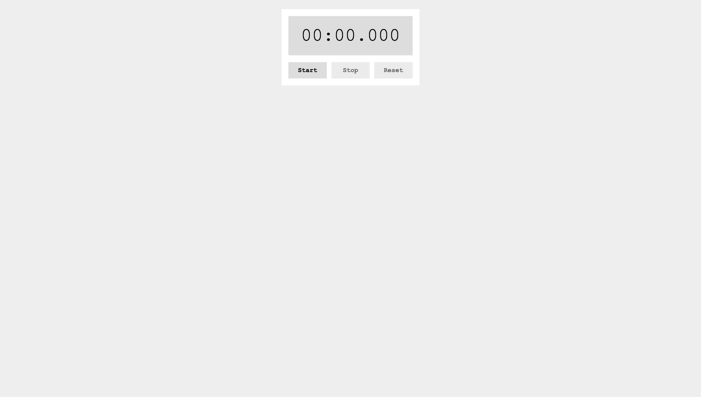

# 🚀 StopWatch

---

## 📸 スクリーンショット(あれば)



---

## 📖 概要

JavaScript の基本理解と DOM 操作、タイマー処理の学習を目的として作成しました。
ストップウォッチアプリを実装し、イベント処理、非同期処理（setTimeout）、クラス操作（classList）を習得しました。

---

## 📂 ファイル構成

```
├── index.html   // ストップウォッチ画面のHTML。表示用のタイマーと3つのボタン(Start/Stop/Reset)を定義
├── style.css    // タイマーとボタンのスタイルシート。位置調整や色指定を担当
└── script.js    // ストップウォッチ機能のロジック全般
                 // ・経過時間の計測と表示
                 // ・Start/Stop/Resetボタンの動作制御
                 // ・ボタンの状態管理（classListによるinactive操作）

```

---

## 🛠 学習内容・技術スタック

- 使用した技術・学んだこと
  - HTML5 / CSS3 / JavaScript（ES6+）
  - DOM 取得・操作（querySelector / textContent / classList）
  - 非同期処理：setTimeout() を用いた時間経過の制御
  - イベントリスナー（addEventListener()）によるボタン処理
  - 条件分岐（if 文）とフラグ管理（startTime, elapsedTime）
  - Date.now() を使った時間計算

---

## 💡 こだわったポイント・工夫したところ

- 分・秒・ミリ秒（3 桁）まで表示し、padStart()で常にゼロ埋め表示
- クリック無効時は inactive クラスを付与して操作不能状態に
- countUp()関数内で setTimeout()を再帰的に呼び、10 ミリ秒ごとに表示更新
- Stop 時に一時停止しても、再 Start で続きからカウント可能になるように「elapsedTime」で履歴管理

---

## 🔍 振り返り・今後の課題

- **できるようになったこと**
  ・基本的なタイマー処理の理解（Date.now, setTimeout）
  ・イベントリスナー・クラス操作の使い方習得
  ・変数管理による状態遷移（start/stop/reset）の制御

- **課題**
  • 秒単位で止まる「ラップタイム機能」の追加
  • タイマー動作中の途中キャンセル処理
  • スタイルの充実（レスポンシブデザイン、ダークモード対応 など）

---

## 🎮 デモページ

実際に動作するストップウォッチはこちらから体験できます。
[https://chisato410.github.io/StopWatch/](https://chisato410.github.io/StopWatch/)
